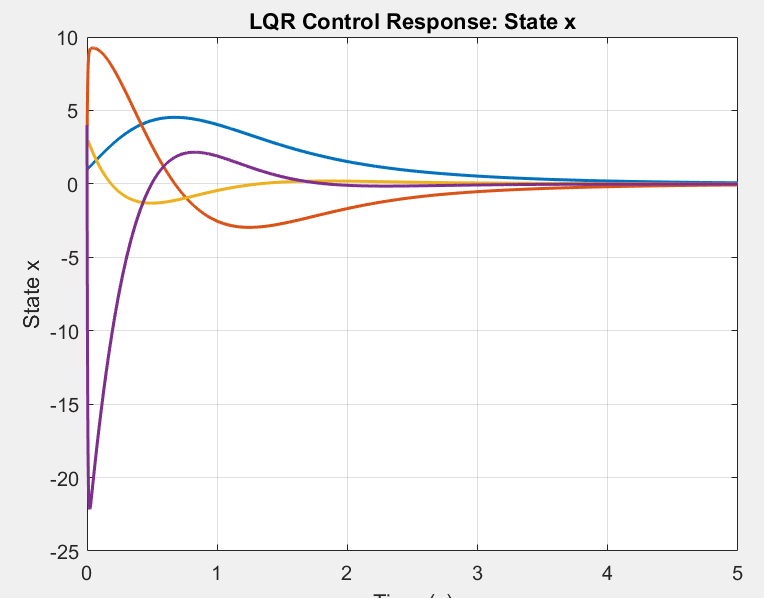

# inverted-pendulum-lqr-control
LQR optimal control of an inverted pendulum on a cart — implemented in MATLAB using state-space representation and ode45 simulation.
 # 🎯 Inverted Pendulum — LQR Optimal Control (MATLAB)

## 📖 Overview
This project implements a **Linear Quadratic Regulator (LQR)** to stabilize 
an inverted pendulum on a cart(control of acceleration). The system is modeled in state-space form 
and simulated using MATLAB's `ode45` solver.

---

## ⚙️ System Parameters
| Parameter | Value | Description |
|-----------|-------|-------------|
| `m` | 9 g | Pendulum mass |
| `M` | 20 g | Cart mass |
| `l` | 25 cm | Pendulum length |
| `g` | 9.81 m/s² | Gravity |

---

## 📐 State-Space Model
The system has 4 states:

| State | Symbol | Description |
|-------|--------|-------------|
| x₁ | `x` | Cart position |
| x₂ | `ẋ` | Cart velocity |
| x₃ | `θ` | Pendulum angle |
| x₄ | `θ̇` | Angular velocity |

**System matrices:**
```
A = [0,  1,           0,  0]
    [0,  0,       -mg/M,  0]
    [0,  0,           0,  1]
    [0,  0,  (M+m)g/lM,  0]

B = [0, 1/M, 0, -1/lM]ᵀ
```

---

## 🎮 LQR Controller
The optimal gain **K** is computed by solving the **Algebraic Riccati Equation**:

- **Cost function:** `min ∫(x'Wx + u'Uu)dt`
- **Weighting matrices:** `W = I₄` (identity), `U = 1`
- **Control law:** `u = -Kx`

---

## 📊 Results
All 4 states converge to zero — the pendulum is successfully stabilized.



---

## 🚀 How to Run
1. Clone the repository:
```bash
   git clone [(https://github.com/Drlecteur19/inverted-pendulum-lqr-control)]
```
2. Open MATLAB
3. Run:
```matlab
   main_lqr_control()
```

---

## 📁 Project Structure
```
📦 inverted-pendulum-lqr-control
 ┣ 📜 main_lqr_control.m   # Main simulation file
 ┣ 📊 results/
 ┃ ┗ 🖼️ lqr_response.png   # Output plot
 ┗ 📄 README.md
```

---

## 🛠️ Requirements
- MATLAB R2018b or later
- Control System Toolbox (for `lqr()`)

---

## 👤 Author
**LAMRI TAOURIRT**
- GitHub: [@Drlecteur19]([https://github.com/Drlecteur19])

---

## 📜 License
MIT License
```

---

## 🏷️ GitHub Topics/Tags to Add
```
matlab  lqr  control-systems  inverted-pendulum  
state-space  optimal-control  ode45  robotics
